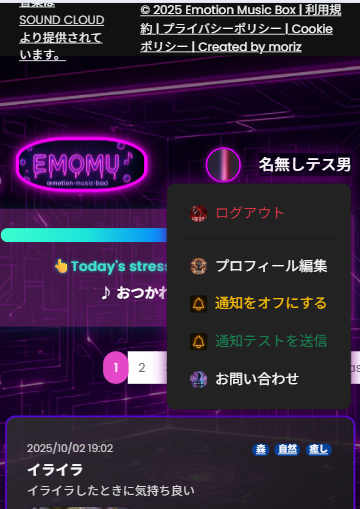

# EMOTION MUSIC BOX (EMOMU)
音楽と感情のアプリ

## 🎧 ほぼ無料で本格運用可能な「音楽 × SNS」型アプリ
※ Render + Neon + Cloudinary + Hotwire + Web Push + SoundCloud API の構成で低コスト運用

---

## 目次
- [サービス概要](#サービス概要)
- [このサービスへの思い・作りたい理由](#このサービスへの思い作りたい理由)
- [ユーザー層について](#ユーザー層について)
- [サービスの差別化ポイント・推しポイント](#サービスの差別化ポイント推しポイント)
- [使い方（3ステップ）](#使い方3ステップ)
- [主な機能](#主な機能)
- [リリース時点の挙動メモ](#リリース時点の挙動メモ)
- [テスト構成（Jest 概要）](#テスト構成jest-概要)
- [使用技術（Tech Stack）](#使用技術tech-stack)
- [💡技術選定理由（EMOTION MUSIC BOX (EMOMU)）](#技術選定理由)
- [ER図](#er図)
- [画面遷移図（Figma）](#画面遷移図figma)

---

## サービス概要

**現代人が日々感じるストレスを、音楽と気分の記録を通じて軽減する。**  
ユーザーはその時の気分に合った音楽を探して再生するだけでなく、**自身の感情と音楽の組み合わせを投稿し、他のユーザーと共有できるコミュニティ型サービス**です。

## このサービスへの思い・作りたい理由

私は以前バンドでライブをしたり曲を作ったり、**音楽に携わること**をしていました。  
**音楽なしでは生きられない**人間でした。  
小学生の時から**iPod**などを使用し、気分によってどんなジャンルの音楽を聴いていたかで**ストレスを和らげていました**。
音楽によるストレス発散は、僕だけじゃなく**誰しもがそうです**。  
だからこそ、このアプリを作りたいと思いました。

## ユーザー層について

**ストレスを抱える現代人、音楽で気分を切り替えたい人。**  
年齢や性別を問わず、**気軽に使えるサービス**です。

## サービスの差別化ポイント・推しポイント

- **感情と音楽の融合**  
  単なる音楽ストリーミングやSNSではなく、「**今の気分**」と「**音楽**」を結びつけることで、自分の状態を客観的に把握しやすくなります。  
  **HPバー**で**ストレス状態を可視化**し、ユーザー自身の変化に気づかせると同時に、**コミュニティの共感**も呼びます。

---

## 使い方（3ステップ）
1. **ログイン or 新規作成**：SoundCloud アカウントでサインイン（未所持ならかんたん新規作成）
2. **投稿**：その時の感情と曲、ひとことを記録
3. **楽しむ**：気になる投稿はブックマークやコメント、プレイリストに追加して再生  
   他ユーザーとの共感性も高めます。

---

## 主な機能

### 1) アカウント / 認証
- SoundCloud OAuth による新規作成＆ログイン（OmniAuth）
- 新規登録者は公式 SoundCloud の登録ページに遷移します（簡単登録）
- 登録後タブを閉じてログインを行ってください
- 初期は SoundCloud ユーザーネームですが、
- お好みでプロフィール編集でプロフィール画像、名前、性別、年齢（任意）が作成できます
- セッション管理（Cookieストア）

※本アプリはSoundCloudのAPIを利用していますが、SoundCloudにより承認・提携・支援されたものではありません。
Screenshots of SoundCloud login UI are used for instructional purposes. © SoundCloud Ltd.

**新規登録**

**ログイン**

### 2) 投稿（感情ログ）
- 感情（例：イライラ / 楽しい など）＋曲情報＋ひとことメモを1つのログとして保存
- 投稿を忘れたときの前日分の投稿も可能
- タグ付け、ブックマーク数・コメント数を表示
- 投稿詳細ページ（モバイル用とPC用の最適化ビュー）

#### 📝 投稿フォーム（約15秒）

---

### 3) 投稿検索・再生
- SoundCloud の曲情報を利用した楽曲再生（オリジナルプレーヤー / リンク再生）
- 投稿にあるアルバム中の再生ボタンを押せば曲へ即アクセス再生
- 下部メニューから検索を押せば条件検索ができる  
  ※デスクトップ版は上メニュー部分にジャンル＆タグ検索、サイドバーでさらに細かい条件検索

---

### 4) 🎵 ブックマーク／プレイリスト作成（約13秒）
- 気になった投稿をブックマーク（♡） 
  マイページの「自分の投稿も含める」にチェックを入れると自分が投稿した投稿楽曲も表示されます
  → プレイリストを作成する
- プレイリスト画面
  - 1曲目から再生
  - 曲を追加：モーダル（ブックマーク・自分の投稿済みの中から、**プレイリスト未収録のみ**を表示）
  - 一覧に戻る
  - 曲の削除
- **Turbo Stream** による即時反映  
  追加／削除で **プレイリスト本体とモーダル候補が自動更新** を実装

---

### 5) 🎧 プレイリスト再生&編集（約17秒）

- 作成したプレイリストは、画面下のボタンから再生・編集・削除を直感的に操作でき、快適に音楽を楽しめます。

---

### 6) 💬 コメント＆リアクション（約10秒）
- 投稿詳細画面にてコメント＆リアクションスペース
- いいね等のリアクション（それな！／よんだ！）
　ユーザー間のコミュニティ＆共感性満足を得られます。

---

### 7) シェア
- X（Twitter）共有ボタン（投稿詳細からワンタップでシェア）
  例：「今日の感情は ○○！！ この気分で聴いた曲は ××」
　SNSにより共感性満足感を高めます。

**ユーザーメニュー**

### 8) モバイル最適化
- モバイル専用のフッター音楽プレーヤー（再生／追加／戻る／削除／次の曲／前の曲／再生時間をコントロールできるシークバー／リピート／シャッフル）
- セーフエリア（iPhone）対応、軽量なUI部品
- 主要操作をフッターメニュー画面下部に集約して片手操作が容易に
- デスクトップ版では、ブラウザのサイズを自由に変更してもレイアウトが瞬時に切り替わるため、常に最適なUIで快適に操作できます。

### 9) 通知（Web Push / VAPID 対応）

EMOMU は **Web Push（VAPID）** に対応しており、  
**コメント・ブックマーク（いいね）・リアクションなどの通知をリアルタイムに受け取れます。**

外部サービス（Firebase / APNs 等）を使わず、  
**ブラウザ標準の Push API / Notifications API のみで完結する軽量設計**です。

※現状、この通知機能は **デスクトップ環境限定** で利用できます。  
（iOS Safari・Android Chrome の仕様により、Web Push の安定運用が難しいため）

#### 📲 対応環境（スマホ / デスクトップ共通）
- 通知は **ユーザーメニュー内に蓄積**され、  
  既読状態・未読バッジ・詳細モーダルなどの UI アクションが利用できます。
- スマホ版・デスクトップ版どちらでも、**同じ通知 UI/UX** で直感的に操作できます。

#### 🔧 技術ポイント
- VAPID による署名つき Web Push（Rails 側で完結）
- Service Worker 経由でバックグラウンド受信
- Turbo と連携した通知リストのリアルタイム更新
- モーダル表示での詳細確認

#### 📚 参考資料
- Push API（MDN）  
  https://developer.mozilla.org/docs/Web/API/Push_API
- Notifications API（MDN）  
  https://developer.mozilla.org/docs/Web/API/Notifications_API
- Web Push 概要（web.dev）  
  https://web.dev/learn/push/

# Emotion Music Box は、感情と音楽をつなげて「今の自分」に寄り添う音楽体験を届けます。

- モバイルでもフッターメニューが常時固定で操作しやすい設計。

## 使用技術（Tech Stack）

| カテゴリ | 技術 |
|---------|------|
| **ランタイム / 基盤** | Ruby 3.2.3 / Rails 7.2.2.1（Hotwire: Turbo / Stimulus） / Docker / Docker Compose |
| **インフラ・ミドルウェア** | **Render（本番ホスティング）** / **Neon（PostgreSQL 本番 DB）** / PostgreSQL（ローカル） / Redis（セッションストア） / Puma（Render 上で稼働）※ローカルは自己署名HTTPS |
| **フロントエンド（Rails 内）** | Hotwire（Turbo / Stimulus） / Bootstrap 5.3 / jsbundling-rails（esbuild） / cssbundling-rails（sass + postcss） / Sprockets（一部） |
| **PWA / Web API** | Service Worker（Web Push / VAPID） / manifest.json / Audio API / Fetch API / IntersectionObserver / MutationObserver |
| **認証・認可** | Devise / OmniAuth（SoundCloud OAuth2 / Generic OAuth2） |
| **ストレージ / 画像** | Active Storage + Cloudinary（CDN配信） / image_processing / **Cropper.js（プロフィール画像編集）** |
| **画面 / UX・ページング・集計** | Kaminari（bootstrap5-kaminari-views） / Groupdate / **Chart.js** |
| **通信 / ユーティリティ** | HTTParty / Faraday（外部 API クライアント） |
| **監視・ログ** | Sentry（sentry-rails / sentry-ruby） / Lograge |
| **テスト** | RSpec / Jest（@testing-library/dom / @testing-library/jest-dom / @testing-library/user-event） / SimpleCov |

## 💡技術選定理由（EMOTION MUSIC BOX (EMOMU)）
📘 EMOTION MUSIC BOX（EMOMU）の技術選定理由

【フロントエンド】

音楽・感情ログを扱うアプリケーションでは、レスポンスの速さと快適な操作感が最も重要だと考えました。
特に EMOMU は「音楽再生中にページ遷移しても途切れない操作体験」が必須であり、Web アプリでありながら ネイティブアプリに近い動作速度 を実現する必要がありました。

そのため、フロントエンドには Rails × Hotwire（Turbo / Stimulus） を採用しました。

Turbo により、ページ全体ではなく必要な部分のみを高速に差し替え、SPA のような軽量遷移を実現。音楽再生中でもプレーヤーが途切れません。

Stimulus は「必要な場所だけロジックを当てる」仕組みのため、音楽検索・プレーヤー操作・モーダル遷移など複雑な UI でもコードが肥大化せず保守しやすい構成を維持できます。

Hotwire は追加ライブラリが不要なため、コストゼロで SPA 並みの体験が可能となり、運用コスト・学習コストの両面で効率的でした。

これにより、高速・軽量・低コストのフロントエンドを構築し、特にモバイルでの快適な UI/UX を実現できました。

【バックエンド】

バックエンドには Ruby on Rails 7 を採用しました。

理由は以下の通りです。

- Rails の「設定より規約」により、認証・CRUD・バリデーション・ER 設計を高速に構築できる
- EMOMU のように投稿・プレイリスト・コメント・通知など機能数が多くても、統一されたコード構造で保守性が高い
- Hotwire との親和性が高く、フロントエンドと自然に連携できる
- 標準機能が充実しており、追加サービスに依存しない構成が組めるため 無料〜極低コストで運用可能

Rails は「作りたい機能を素早く形にする」ことに強く、EMOMU の開発スピードや拡張性と非常に相性が良い選択でした。

【データベース】

データベースには PostgreSQL（Neon/Postgres） を採用しました。

EMOMU では以下のように多くのリレーションを扱います。

- 投稿（曲情報・感情・コメント）
- ブックマーク（いいね）
- プレイリスト（多対多）
- 通知ログ
- SoundCloud OAuth 情報

PostgreSQL はリレーション・JSON・日付集計に強く、Rails とも相性が非常によいため最適でした。

また Neon のサーバーレス構成により、無料枠でも十分な性能を維持でき、運用コストをほぼゼロに抑えられる点も選定理由の一つです。

【認証】

認証には OmniAuth（SoundCloud OAuth2） を採用しました。

理由は以下の通りです。

- 音楽アプリとして SoundCloud アカウントでログインできる自然な体験を提供できる
- メールアドレスやパスワード入力が不要で、ワンタップ登録が可能
- 曲検索・再生を行う SoundCloud API と OAuth の連携がスムーズに行える
- 外部 ID 認証によりサーバー側セッションの負荷を軽減でき、コスト削減と UX 向上を両立できる

【ストレージ（画像）】

画像ストレージには Cloudinary を採用しました。

- プロフィール画像などを自動でリサイズ・最適化
- CDN 配信により高速表示
- 無料枠の範囲で十分運用できる

特に PWA を採用したモバイルファースト設計では、軽量で高速な画像配信は不可欠であり、Cloudinary は最適でした。

【UI / デザイン】

UI には Bootstrap 5 + Sass を採用し、必要な部分をカスタム CSS で補っています。

理由は以下の通りです。

- モバイル UI を短時間で整えられる
- フッター固定プレーヤーなど特殊な UI に対応しやすい
- 初めて使うユーザーでも直感的に操作できるデザインが作りやすい
- Tailwind のような追加学習コストが不要で、効率よく実装できる
- PC／モバイル間で大きくレイアウトを切り替える必要があり、Bootstrap のブレークポイントが非常に有効

さらに EMOMU では、通常の SoundCloud ウィジェットを iframe でそのまま表示せず、UI/UX の最適化を目的に “オリジナル音楽プレーヤー” を独自実装しました。

実装したプレーヤー機能は以下の通りです。

- 自動再生（iOS の制約対応含む）
- 再生・一時停止
- 次の曲・前の曲
- シークバーによる再生位置の制御
- 曲情報の動的表示
- プレイリストとの連携（連続再生）
- モバイル専用レイアウト（片手操作に最適化）

これにより、音楽再生を途切れさせず、Turbo 遷移でもスムーズに動く Web 音楽アプリ体験を実現できました。

UI/UX を最優先しつつ、追加費用なしでリッチな音楽体験を提供できる点は大きな特徴です。

【通知（Web Push / VAPID）】

通知は Firebase など外部サービスを使用せず、Web Push（VAPID） を採用しました。
（現状は主にデスクトップ向けの提供です。）

- Rails だけで通知処理が完結
- サービスワーカーで動作し、追加コスト不要
- 外部依存がないため、コスト最小・自由度最大 の構成が可能

【環境構築】

開発環境には Docker / docker-compose を採用しました。

理由は以下の通りです。

- 環境差分が出ないため、レビューや共同作業がしやすい
- Ruby、Node、PostgreSQL を完全に隔離して扱える
- 機能追加やアップデート時も環境が壊れにくい
- 「環境トラブルで時間を奪われたくない」という方針に合っている

【CI/CD】

デプロイには Render（GitHub 連携による自動デプロイ） を採用しました。

- GitHub に push するだけで本番反映
- SSL を自動付与
- Docker と Rails の相性が良い
- Render のシェル利用に必要な小額の課金（約500円）だけで本格的な CI/CD が構築可能

設定が非常に簡単で、開発リズムを崩さず運用できる点が大きな魅力でした。

【技術選定の総括】

EMOMU の技術選定は次の 2 点を最優先にしています。

1. 運用コストを極限まで抑える
Render、Neon、Cloudinary、Hotwire、Web Push、SoundCloud API を組み合わせ、
## 💰 ほぼ無料で本格運用可能

2. スマホで快適な UI/UX を実現する
Turbo による高速遷移、独自プレーヤーによる途切れない音楽体験、モバイル最適化された UI により、音楽 × 感情ログという EMOMU の体験価値を最大化。

### ER図

📥 [ER図をダウンロードする（PNG）](docs/diagrams/emotion_music_er.png)

## 画面遷移図（Figma）

> 詳細な画面遷移は Figma を参照してください。

- Figma: emotion_music3  
  https://www.figma.com/design/FglcI4oHKG1LdAOzUg4103/emotion_music3?node-id=0-1&m=dev&t=PpWZOzjESTKnPbQv-1

## リリース時点の挙動メモ

- iOS の Web Push は技術的制約のため未対応
- SoundCloud API のレート制限について
本アプリでは、SoundCloud API を通じて楽曲ストリーミングおよびメタデータ取得を行っています。SoundCloud 側の仕様により、再生可能ストリームアクセスは「1アプリケーションあたり24時間で15,000回、別途検索は（1時間で 30,000 リクエスト）」の上限が設定されています。
そのため、当アプリではキャッシュ戦略やアクセス回数の監視を行い、制限に到達した場合のユーザー影響を最小化する設計としています。